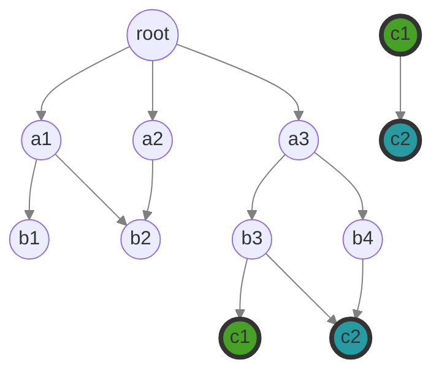

# django-directed

Tools for building, querying, manipulating, and exporting [directed graphs](https://en.wikipedia.org/wiki/Directed_graph) with django.

Documentation can be found at https://django-directed.readthedocs.io/en/latest/

```{caution}
This project is very much a Work In Progress, and is not production-ready.
Once it is is a more complete state, it will be moved to the github Watervize
organization for long-term development and maintenance.
```

## Fundamentals

Graphs in django-directed are constructed with three models (or potentially more in case of extended features).

- **Graph**: Represents a connected graph of nodes and edges. It makes it easy to associate metadata with a particular graph and to run commands and queries limited to a subset of all the Edges and Nodes in the database.
- **Edge**: Connects Nodes to one another within a particular Graph instance.
- **Node**: A node can belong to more than one Graph. This allows us to represent multi-dimensional or multi-layered graphs.

django-directed includes model factories for building various types of directed graphs. As an example, imagine a project in which you display family trees and also provide a searchable interface for research papers about family trees, where papers can be linked to previous papers that they cite. Both of these concepts can be represented by a [Directed Acyclic Graph (DAG)](https://en.wikipedia.org/wiki/Directed_acyclic_graph), and within your project you could create a set of DAG models for the family tree app and another set of DAG models for the academic papers app.


## Quickstart

Assuming you have already started a django project and an app named `myapp`

### Install django-directed

```bash
pip install django-directed
```

### Create the concrete models

Using the DAG factory, create a set of concrete Graph, Edge, and Node models for your project. Perform the following steps in your app's models.py

Build a configuration object that will be passed into the factory. Here, we are using the simplest configuration which specifies the model (with `appname.ModelName`), but uses the default values for all other configuration options.

```python
from django_directed.models import GraphConfig

my_config = GraphConfig(
    graph_model_name="myapp.DAGGraph",
    edge_model_name="myapp.DAGEdge",
    node_model_name="myapp.DAGNode",
)
```

Create the concrete models from a model factory service. In this example, we are adding some fields as an example of what you might do in your own application.

```python
# Create DAG factory instance
dag = factory.create("DAG", config=my_config)

# Create concrete models
class DAGGraph(dag.graph()):
    metadata = models.JSONField(default=str, blank=True)


class DAGEdge(dag.edge()):
    name = models.CharField(max_length=101, blank=True)
    weight = models.SmallIntegerField(default=1)

    def save(self, *args, **kwargs):
        self.name = f"{self.parent.name} {self.child.name}"
        super().save(*args, **kwargs)


class DAGNode(dag.node()):
    name = models.CharField(max_length=50)
    weight = models.SmallIntegerField(default=1)
```

```{note}
The model names here (DAGGraph, etc) are for example only. You are welcome to use whatever names you like, but the model names should match the names provided in the configuration.
```

### Migrations

As usual when working with models in django, we need to make migrations and then run them.

```bash
python manage.py makemigrations
python manage.py migrate
```

### Build out a basic graph

```{tip}
We are using the `graph_context_manager` here, which is provided in django-directed for convenience. If you decide not to use this context manager, you need to provide the graph instance when creating or querying with Nodes and Edges.
```

```bash
from django_directed.context_managers import graph_scope
from myapp.models import DAGGraph, DAGEdge, DAGNode


# Create a graph instance
first_graph = DAGGraph.objects.create()
# Creating a second graph instance, which will share nodes with first_graph
another_graph = DAGGraph.objects.create()

with graph_scope(first_graph):

    # Create several nodes (not yet connected)
    root = DAGNode.objects.create(name="root")

    a1 = DAGNode.objects.create(name="a1")
    a2 = DAGNode.objects.create(name="a2")
    a3 = DAGNode.objects.create(name="a3")

    b1 = DAGNode.objects.create(name="b1")
    b2 = DAGNode.objects.create(name="b2")
    b3 = DAGNode.objects.create(name="b3")
    b4 = DAGNode.objects.create(name="b4")

    c1 = DAGNode.objects.create(name="c1")
    c2 = DAGNode.objects.create(name="c2")

    # Connect nodes with edges
    root.add_child(a1)
    root.add_child(a2)

    # You can add from either side of the relationship
    a3.add_parent(root)

    b1.add_parent(a1)
    a1.add_child(b2)
    a2.add_child(b2)
    a3.add_child(b3)
    a3.add_child(b4)

    b3.add_child(c2)
    b3.add_child(c1)
    b4.add_child(c2)

with graph_scope(another_graph):

    # Connect nodes with edges
    c1 = DAGNode.objects.get(name="c1")
    c2 = DAGNode.objects.get(name="c2")

    c1.add_child(c2)
```

### Resulting Model Data

Here is the resulting data in each model (ignoring the custom fields added in the concrete model definitions).

#### myapp.DAGGraph

     id
    ----
      1
      2

#### myapp.DAGNode

     id  | name | graph
    -----+------+------
      1  | root |  1
      2  | a1   |  1
      3  | a2   |  1
      4  | a3   |  1
      5  | b1   |  1
      6  | b2   |  1
      7  | b3   |  1
      8  | b4   |  1
      9  | c1   |  1
      10 | c2   |  1

#### myapp.DAGEdge

    id  | parent_id | child_id | name    | graph
    ----+-----------+----------+---------+------
     1  |  1        |  2       | root a1 |  1
     2  |  1        |  3       | root a2 |  1
     3  |  1        |  4       | root a3 |  1
     4  |  2        |  5       | a1 b1   |  1
     5  |  2        |  6       | a1 b2   |  1
     6  |  3        |  6       | a2 b2   |  1
     7  |  4        |  7       | a3 b3   |  1
     8  |  4        |  8       | a3 b4   |  1
     9  |  7        |  10      | b3 c2   |  1
     10 |  7        |  9       | b3 c1   |  1
     11 |  8        |  10      | b4 c2   |  1
     12 |  9        |  10      | c1 c2   |  2

### Graph visualization

```{note}
In the visualized graph below, both of the green nodes (c1) refer to the same Node instance, which is associated with two different graph instances. Likewise, both blue nodes (c2) refer to the same Node instance.
```

```{note}
The mermaid.js diagrams require different markup for GitHub markdown compared to display within ReadTheDocs. Both versions are included here, but one will likely appear as code depending on where you are viewing this file.
```

#### Graph for display on GitHub



#### Graph for display on ReadTheDocs

```{mermaid}
graph TD;
    root((root));
    a1((a1));
    a2((a2));
    a3((a3));
    b1((b1));
    b2((b2));
    b3((b3));
    b4((b4));
    c1((c1));
    c2((c2));
    c1X((c1));
    c2X((c2));

    root-->a1;
    root-->a2;
    root-->a3;
    a1-->b1;
    a1-->b2;
    a2-->b2;
    a3-->b3;
    a3-->b4;
    b3-->c1;
    b3-->c2;
    b4-->c2;

    c1X-->c2X;

    style c1 fill:#48A127,stroke:#333,stroke-width:4px;
    style c1X fill:#48A127,stroke:#333,stroke-width:4px;
    style c2 fill:#279BA1,stroke:#333,stroke-width:4px;
    style c2X fill:#279BA1,stroke:#333,stroke-width:4px;

    linkStyle default fill:none,stroke:gray
```

### Find the shortest path between two nodes

First, let us try to get the shortest path from `c1` and `c2` on `first_graph`, where no path exists:

```python
with graph_scope(first_graph):
    c1 = DAGNode.objects.get(name="c1")
    c2 = DAGNode.objects.get(name="c2")

    print(c1.shortest_path(c2))
```

*Output*: `django_directed.models.NodeNotReachableException`

Next, we will perform the same query on `another_graph`, which *does* have a path from `c1` to `c2` through a single Edge. The value returned is a QuerySet of the Nodes in the path.

```python
with graph_scope(another_graph):
    c1 = DAGNode.objects.get(name="c1")
    c2 = DAGNode.objects.get(name="c2")

    print(c1.shortest_path(c2))
```

*Output*: `<QuerySet [<NetworkNode: c1>, <NetworkNode: c2>]>`

For additional methods of querying, see the API docs for [Graph](https://django-directed.readthedocs.io/en/latest/api/graph.html), [Edge](https://django-directed.readthedocs.io/en/latest/api/edge.html), and [Node](https://django-directed.readthedocs.io/en/latest/api/node.html).

## Example apps

```{note}
These are in-progress, and not ready for actual use.
```

A series of example apps demonstrating vaious aspects and techniques of using django-directed.

- **[Airports](https://github.com/jacklinke/django-directed/tree/main/tests/example/airports)** - An app demonstrating one method of working with multidimensional graphs to model airports with a common set of nodes, and edges for each of the connecting airlines.
- **[Electrical Grids](https://github.com/jacklinke/django-directed/tree/main/tests/example/electrical_grids)** - Demonstrate graphs of neighborhood electrical connections and meters.
- **[Family Trees](https://github.com/jacklinke/django-directed/tree/main/tests/example/family_tree)** - Demonstrates building family trees for multiple mythological families.
- **[Forums](https://github.com/jacklinke/django-directed/tree/main/tests/example/forums)** - Forums and threaded comments.
- **[NetworkX Graphs](https://github.com/jacklinke/django-directed/tree/main/tests/example/networkx_graphs)** - Demonstration of using NetworkX alongside django-directed.

See the [Example Apps](https://github.com/jacklinke/django-directed/tree/main/tests/example) folder.

## Why not use a graph database instead?

- **Compatibility** - Graph databases don't play very nicely with Django and the Django ORM. There are 3rd party packages to shoehorn in the required functionality, but django is designed for relational databases.
- **Simplicity** - If most of the work you are doing needs a relational database, mixing an additional entirely different kind of database into the project might not be ideal.
- **Tradeoffs** - Graph databases are not a panacea. They bring their own set of pros and cons. Maybe a graph database is ideal for your project. But maybe you'll do just as well using django-directed. I encourage you to read up on the benefits graph databases bring, the issues they solve, and also the areas where they do not perform as well as a relational database.
